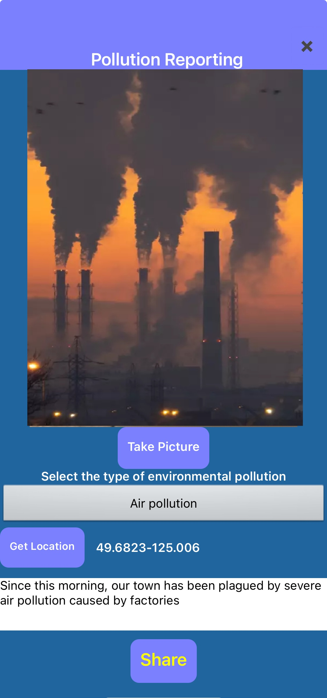
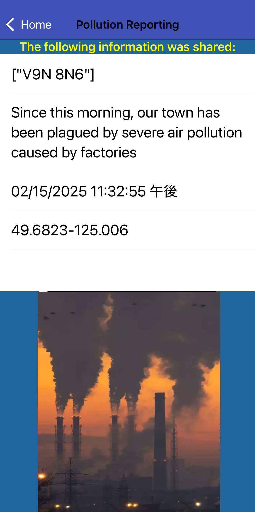
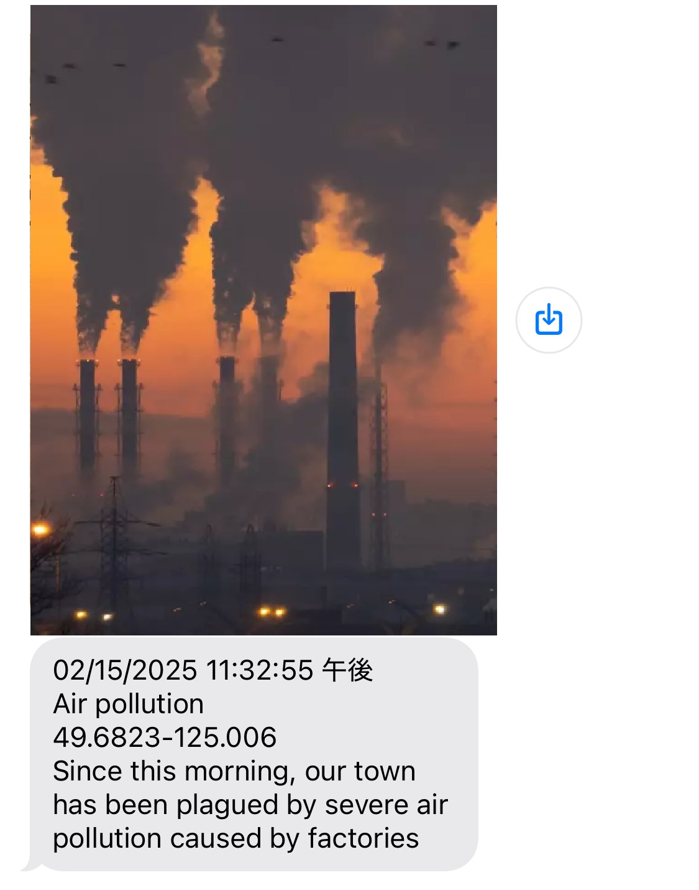
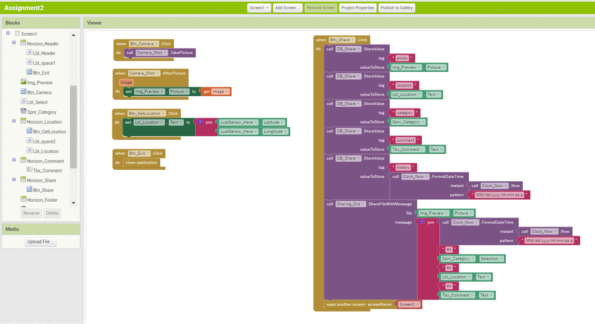
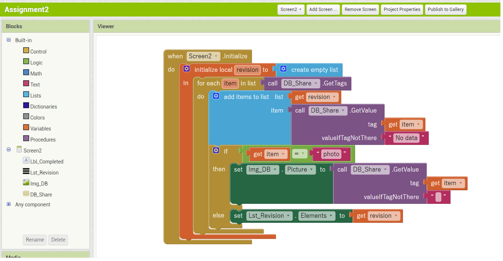

# WakakoHatta-Polution-reporting-app
<!--
*** README.md Reference: https://github.com/othneildrew/Best-README-Template/tree/master
-->

<!-- PROJECT  -->

  <h3 align="center">Pollution Reporting App</h3>

<!-- ABOUT THE PROJECT -->

## About The Project
This pollution reporting app allows local residents and environmental activists to take photos of the current state of pollution and share them via social media or email along with a comment about the type of pollution and its location (latitude and longitude).

### Screens of the app
  <ol>
    <li>
     Main screen
    </li>
    <li>
     Completed Sharing screen
    </li>
  </ol>

### Main components using in the app
  <ol>
    <li>
      Camera - Take a picture of pollution situation
    </li>
    <li>
      Storage/TingDB - Save Photo path, Category of pollution, Place, Comment 
    </li>
    <li>
      LocationSensor - Get the latitude and longitude
    </li>
    <li>
      Clock - Get the current date and time
    </li>
    <li>
      Sharing - Launch SNS applications
    </li>
  </ol>

## Main Screen

- Take picture function
- Show the taken picture
- Select the pollution category 
- Get the latitude and longitude button  
- Input comment textbox 
- Launch the selection screen sharing app and share the pollution information by Sharing button 

  

## Completed Sharing screen

- Automatically opend this scrren after sharing the pollution information
- Show the information and picture at the Main Screen from TinyDB

   
  
Sharing to Message mobile

  

## Code block Snapshots

  
  

## Built With
- MIT app inventor Reference :
  How do I use TinyDB? - https://community.appinventor.mit.edu/t/how-do-i-use-tinydb/51422

- MIT App Inventor Sharing Component - https://www.youtube.com/watch?v=e8HzNS-EQ-g

- Translation Reference:
  ChatGPT -  https://chat.openai.com/

## Summary details
### development process
Since I had never used TinyDB before, I had to go through multiple rounds of trial and error to store data in the database and then retrieve and display it as a list on the next screen. Additionally, I couldn't simply place the components in the layout, so I adjusted them using Arrangements.

## code review
The code is very simple.

<!-- ACKNOWLEDGMENTS -->

## Acknowledgments

I used the following sites:
- [MIT APP INVENTOR](https://appinventor.mit.edu/)

